# ESP32 Solar Egg Incubator Dashboard

A modern IoT dashboard for monitoring and controlling a solar-powered egg incubator system with real-time MQTT communication, built with Next.js 16, TypeScript, and Shadcn UI.

[](https://nextjs.org/)
[](https://www.typescriptlang.org/)
[](https://firebase.google.com/)
[](https://mqtt.org/)

## 🎯 System Overview

The system combines solar thermal heating, grid backup, and ESP32-based precision control to maintain optimal temperature (37.5°C) and humidity (50–80% RH) for chicken egg incubation over a 21-day cycle.

### Key Features
- ☀️ **Solar + Grid Hybrid Power** - Automatic switching between solar and grid
- 🌡️ **Real-time Monitoring** - Temperature, humidity, and system status via MQTT
- 🎛️ **Remote Control** - Full actuator control from web dashboard
- 📊 **Data Logging** - Firebase Firestore with historical charts
- 📱 **Responsive UI** - Modern IoT dashboard with dark theme
- 🔄 **Automated Egg Turning** - Programmable stepper motor control
- 💧 **Humidity Management** - Automated solenoid valve control
- 🌬️ **Ventilation Control** - Servo-actuated flaps for temperature regulation

---

## 📋 Table of Contents
1. [System Architecture](#-system-architecture)
2. [Hardware Components](#-hardware-components-bom)
3. [Circuit Diagram](#-circuit-diagram)
4. [System Flow Diagram](#-system-flow-diagram)
5. [Dashboard Setup](#-dashboard-setup)
6. [Arduino Setup](#-arduino-setup)
7. [MQTT Configuration](#-mqtt-configuration)
8. [Usage Guide](#-usage-guide)

---

## 🏗️ System Architecture


---

## 🔧 Hardware Components (BOM)

### Core Electronics
| Component | Model/Spec | Quantity | Purpose |
|-----------|------------|----------|---------|
| **Microcontroller** | ESP32 DevKit (NodeMCU) | 1 | Main controller with WiFi |
| **Temperature/Humidity Sensor** | DHT11 | 1 | Environment monitoring |
| **Display** | I2C LCD 16x2 (Blue backlight) | 1 | Local status display |
| **Relay Module** | JQC3F-05VDC-C (5V coil) | 4 | Switching 12V loads |
| **Power Relay** | 12V 30A SL-C | 1 | Solar/Grid switching |
| **Voltage Regulator** | LM7805 or Buck Converter | 1 | 12V to 5V for ESP32 |

### Actuators
| Component | Model/Spec | Quantity | Purpose |
|-----------|------------|----------|---------|
| **Heating Element** | Soldering iron element (~40-60W) | 1 | Primary heating source |
| **Internal Fan** | 12V DC 60mm, 0.2A | 1 | Air circulation |
| **Solar Fans** | 12V DC 60mm, 0.2A | 2 | Push hot air from solar collector |
| **Servo Motors** | SG90 (180° rotation) | 2 | Solar inlet flap + top vent |
| **Stepper Motor** | NEMA17 (1.8°/step) | 1 | Egg tray rotation |
| **Stepper Driver** | A4988 | 1 | Stepper motor control |
| **Solenoid Valve** | 12V DC, 1/4" | 1 | Water release for humidity |

### Power & Protection
| Component | Model/Spec | Quantity | Purpose |
|-----------|------------|----------|---------|
| **Capacitors** | 1000µF 16V electrolytic | 2 | Main 12V rail filtering |
| **Capacitors** | 100µF 16V electrolytic | 4 | Servo/driver decoupling |
| **Fuses** | 25A blade fuse | 2 | Solar + Grid protection |
| **Diodes** | 1N4007 | 6 | Flyback protection (relays + solenoid) |
| **Thermal Fuse** | 77°C cutoff | 1 | Heater safety |
| **Resistors** | 10kΩ | 1 | DHT11 pull-up |
| **Resistors** | 1kΩ | 1 | Relay transistor base |
| **Transistors** | 2N2222 NPN | 1 | Power relay switching |

### Power Sources
| Component | Spec | Purpose |
|-----------|------|---------|
| **Solar Inverter** | 12V DC output | Primary power (daytime) |
| **Grid Adapter** | 12V DC, min 5A | Backup power (night/cloudy) |

### Wiring & Connectors
- 16 AWG wire (red/black) for 12V main rails
- 20-22 AWG wire for fans, motors, solenoid
- 22-24 AWG wire for GPIO signals, sensors
- 14 AWG wire or copper bus bar for common ground
- Terminal blocks, wire nuts, heat shrink tubing

---

## 🔌 Circuit Diagram

### ESP32 Pin Assignment Table

| GPIO Pin | Function | Component | Type | Notes |
|----------|----------|-----------|------|-------|
| **GPIO4** | DHT11 Data | Temperature/Humidity Sensor | Input | 10kΩ pull-up to 3.3V |
| **GPIO12** | Servo 1 PWM | Solar Inlet Flap | Output (PWM) | 50Hz, 1-2ms pulse |
| **GPIO13** | Servo 2 PWM | Top Vent Control | Output (PWM) | 50Hz, 1-2ms pulse |
| **GPIO14** | Relay Control | Solar Fans (2×) | Output | Digital HIGH/LOW |
| **GPIO18** | Stepper STEP | A4988 Driver | Output | Pulse train for rotation |
| **GPIO19** | Stepper DIR | A4988 Driver | Output | Rotation direction |
| **GPIO21** | I2C SDA | LCD Display | I2C Data | ESP32 default SDA |
| **GPIO22** | I2C SCL | LCD Display | I2C Clock | ESP32 default SCL |
| **GPIO23** | Relay Control | Solenoid Valve | Output | Digital HIGH/LOW |
| **GPIO26** | Relay Control | Heating Element | Output (PWM) | For PID control |
| **GPIO27** | Relay Control | Internal Fan | Output | Digital HIGH/LOW |
| **GPIO32** | Stepper ENABLE | A4988 Driver | Output | LOW=enabled, HIGH=disabled |
| **3.3V** | Power Out | DHT11 VCC | Power | 3.3V for DHT11 |
| **5V** | Power Out | LCD, Servos, Relays | Power | 5V rail from regulator |
| **GND** | Ground | All components | Ground | Common ground bus |

### Detailed Wiring Diagrams

For complete wiring instructions including:
- Power distribution network (solar/grid switching)
- Relay module connections with flyback protection
- Stepper motor wiring with A4988 driver
- Servo connections with proper power filtering
- Sensor connections (DHT11, LCD I2C)
- Ground bus configuration

**See:** [WIRING-DIAGRAM-TEXT.md](./docs/WIRING-DIAGRAM-TEXT.md) (ASCII diagrams)
**See:** [WIRING-DIAGRAM-MERMAID.md](./docs/WIRING-DIAGRAM-MERMAID.md) (Mermaid diagrams)
**See:** [WIRING-DIAGRAM-ERASER.md](./docs/WIRING-DIAGRAM-ERASER.md) (Eraser.io format)

---

## 🔄 System Flow Diagram

```mermaid
sequenceDiagram
    participant User
    participant Dashboard as Next.js Dashboard
    participant MQTT as MQTT Broker
    participant ESP32
    participant Sensors as DHT11 Sensor
    participant Actuators as Relays/Servos/Stepper
    participant Firebase as Firestore DB

    Note over ESP32: System Boot
    ESP32->>ESP32: Connect to WiFi
    ESP32->>MQTT: Connect & Subscribe to control topic
    ESP32->>MQTT: Publish status: "online"
    Dashboard->>MQTT: Subscribe to status/sensors/response
    MQTT->>Dashboard: Status: online
    Dashboard->>Dashboard: Update UI (Connected)

    loop Every 5 seconds (default)
        ESP32->>Sensors: Read temperature & humidity
        Sensors-->>ESP32: Return readings
        ESP32->>MQTT: Publish sensor data + device states
        MQTT->>Dashboard: Forward sensor data
        Dashboard->>Dashboard: Update real-time display
        Dashboard->>Firebase: Auto-save every 30 seconds
    end

    User->>Dashboard: Click "Heater ON"
    Dashboard->>MQTT: Publish {"heater": true}
    MQTT->>ESP32: Receive control command
    ESP32->>Actuators: Set GPIO26 HIGH (relay on)
    Actuators-->>ESP32: Heater activated
    ESP32->>MQTT: Publish response {"success": true}
    MQTT->>Dashboard: Forward response
    Dashboard->>Dashboard: Update UI with confirmation

    User->>Dashboard: Adjust servo angle (slider)
    Dashboard->>MQTT: Publish {"solar_inlet": 90}
    MQTT->>ESP32: Receive servo command
    ESP32->>Actuators: Write 90° to Servo 1
    Actuators-->>ESP32: Servo moves to position
    ESP32->>MQTT: Publish updated sensor data
    MQTT->>Dashboard: Servo angle confirmed
    Dashboard->>Dashboard: Update slider position

    User->>Dashboard: Click "Turn Eggs"
    Dashboard->>MQTT: Publish {"turn_eggs": true}
    MQTT->>ESP32: Receive turn command
    ESP32->>ESP32: Display "Turning Eggs..." on LCD
    ESP32->>Actuators: Enable stepper + rotate 45° left
    Note over Actuators: Wait 10 seconds
    ESP32->>Actuators: Rotate 45° right + disable stepper
    ESP32->>MQTT: Publish response {"success": true}
    MQTT->>Dashboard: Turn complete confirmation

    User->>Dashboard: Click "Save Data"
    Dashboard->>Firebase: Manual save to Firestore
    Firebase-->>Dashboard: Save confirmation
    Dashboard->>User: Alert: "Data saved!"

    User->>Dashboard: View historical charts
    Dashboard->>Firebase: Query last 50 readings
    Firebase-->>Dashboard: Return timestamped data
    Dashboard->>Dashboard: Render Recharts graphs
```



---

## 🖥️ Dashboard Setup

### Prerequisites
- **Node.js** 18.x or higher
- **npm** or **yarn** package manager
- **Git** for cloning the repository
- **Firebase account** (free tier works)
- **MQTT broker** access (HiveMQ free tier or self-hosted)

### Step 1: Clone the Repository
```bash
git clone <repository-url>
cd incubator-dashboard
```

### Step 2: Install Dependencies
```bash
npm install
```

### Step 3: Firebase Configuration

1. Go to [Firebase Console](https://console.firebase.google.com/)
2. Create a new project or select existing
3. Enable **Firestore Database**:
   - Click "Firestore Database" → "Create database"
   - Start in **test mode** (change rules for production)
   - Choose a region close to you
4. Get your Firebase config:
   - Project Settings → General → Your apps
   - Click "Web" icon → Register app
   - Copy the `firebaseConfig` object

5. Update `firebase.config.ts` with your credentials:
```typescript
import { initializeApp } from 'firebase/app';
import { getFirestore } from 'firebase/firestore';

const firebaseConfig = {
  apiKey: "YOUR_API_KEY",
  authDomain: "YOUR_PROJECT.firebaseapp.com",
  projectId: "YOUR_PROJECT_ID",
  storageBucket: "YOUR_PROJECT.appspot.com",
  messagingSenderId: "YOUR_SENDER_ID",
  appId: "YOUR_APP_ID"
};

const app = initializeApp(firebaseConfig);
export const db = getFirestore(app);
```

### Step 4: Environment Variables

Create a `.env.local` file in the root:
```env
# MQTT Broker Configuration
NEXT_PUBLIC_MQTT_BROKER=broker.hivemq.com
# For local broker: NEXT_PUBLIC_MQTT_BROKER=localhost

# If using authenticated broker (optional)
# NEXT_PUBLIC_MQTT_USERNAME=your_username
# NEXT_PUBLIC_MQTT_PASSWORD=your_password
```

### Step 5: Build and Run

**Development mode:**
```bash
npm run dev
```
Dashboard will be available at `http://localhost:3000`

**Production build:**
```bash
npm run build
npm start
```

### Step 6: Verify Connection

1. Open dashboard in browser
2. Check browser console for MQTT connection logs:
   - ✅ MQTT Connected
   - 📡 Subscribed to status/sensors/response
3. Status badge should show "Disconnected" (red) until ESP32 connects

---

## 🔌 Arduino Setup

### Prerequisites
- **Arduino IDE** 1.8.x or 2.x
- **ESP32 Board Support** installed
- **USB cable** for ESP32 programming

### Step 1: Install Arduino IDE

Download from [arduino.cc](https://www.arduino.cc/en/software)

### Step 2: Install ESP32 Board Support

1. Open Arduino IDE
2. Go to **File → Preferences**
3. Add to "Additional Boards Manager URLs":
   ```
   https://raw.githubusercontent.com/espressif/arduino-esp32/gh-pages/package_esp32_index.json
   ```
4. Go to **Tools → Board → Boards Manager**
5. Search "ESP32" and install "esp32 by Espressif Systems"
6. Select **Tools → Board → ESP32 Arduino → ESP32 Dev Module**

### Step 3: Install Required Libraries

Go to **Sketch → Include Library → Manage Libraries**, search and install:

| Library | Version | Purpose |
|---------|---------|---------|
| **PubSubClient** | 2.8+ | MQTT communication |
| **ArduinoJson** | 6.21+ | JSON parsing/serialization |
| **DHT sensor library** | 1.4.4+ | DHT11 reading |
| **Adafruit Unified Sensor** | 1.1.9+ | DHT dependency |
| **ESP32Servo** | 0.13+ | Servo control |
| **LiquidCrystal I2C** | 1.1.2+ | LCD display |

### Step 4: Configure WiFi and MQTT

Open `lib/incubator.ino` and edit lines 10-16:

```cpp
// ============ WiFi Configuration ============
const char* ssid = "YOUR_WIFI_SSID";           // Replace with your WiFi name
const char* password = "YOUR_WIFI_PASSWORD";   // Replace with your WiFi password

// ============ MQTT Configuration ============
const char* mqtt_server = "broker.hivemq.com"; // Or your broker IP
const int mqtt_port = 1883;
const char* mqtt_client_id = "ESP32_Incubator_001";  // Unique ID
```

**For local MQTT broker:**
```cpp
const char* mqtt_server = "192.168.1.100";  // Your computer's local IP
```

### Step 5: Upload Code

1. Connect ESP32 via USB
2. Select correct **Port** under Tools → Port
3. Click **Upload** button (→)
4. Wait for "Done uploading" message
5. Open **Serial Monitor** (Tools → Serial Monitor, 115200 baud)

### Step 6: Verify Operation

Serial monitor should show:
```
=================================
ESP32 Incubator MQTT Starting...
=================================

✓ LCD initialized
✓ DHT11 sensor initialized
✓ All relays set to OFF
✓ Stepper motor initialized (disabled)
✓ Servo motors initialized (0°)

🌐 Connecting to WiFi: YourSSID
...........
✓ WiFi Connected!
  IP Address: 192.168.1.XXX
  Signal: -45 dBm

📡 Connecting to MQTT Broker: broker.hivemq.com
✓ MQTT Connected!
  Subscribed to: incubator/esp32/control

📤 Status published: online

📊 Sensor Data Published:
  Temperature: 25.3°C
  Humidity: 60.2%
```

---

## 📡 MQTT Configuration

### MQTT Topics

| Topic | Direction | Purpose | Payload Example |
|-------|-----------|---------|-----------------|
| `incubator/esp32/status` | ESP32 → Dashboard | Device status | `{"status":"online","device":"ESP32_Incubator","ip":"192.168.1.100","uptime":3600,"rssi":-45}` |
| `incubator/esp32/sensors` | ESP32 → Dashboard | Sensor readings | `{"timestamp":123456,"temperature":37.5,"humidity":55.0,"heater":true,"fan":false,"solar_fans":false,"solenoid":false,"servo1_angle":0,"servo2_angle":0,"uptime":3600,"rssi":-45,"free_heap":200000}` |
| `incubator/esp32/control` | Dashboard → ESP32 | Control commands | `{"heater":true}` or `{"solar_inlet":90}` or `{"turn_eggs":true}` |
| `incubator/esp32/response` | ESP32 → Dashboard | Command responses | `{"timestamp":123456,"message":"Heater turned ON","success":true}` |

### Control Commands

**Relay Controls (ON/OFF):**
```json
{"heater": true}
{"internal_fan": true}
{"solar_fans": true}
{"solenoid": true}
```

**Servo Controls (0-180°):**
```json
{"solar_inlet": 90}
{"top_vent": 45}
```

**Stepper Motor:**
```json
{"turn_eggs": true}
```

**Update Interval (ms):**
```json
{"interval": 5000}
```

### Using Free MQTT Brokers

**HiveMQ Public Broker (Default):**
- Host: `broker.hivemq.com`
- Port: 1883 (TCP), 8083 (WebSocket)
- No authentication required
- [Dashboard](https://www.hivemq.com/demos/websocket-client/)

**Mosquitto (Self-hosted):**
```bash
# Install
sudo apt-get install mosquitto mosquitto-clients

# Enable WebSocket on port 8083
# Edit /etc/mosquitto/mosquitto.conf:
listener 1883
listener 8083
protocol websockets

# Restart
sudo systemctl restart mosquitto
```

**Testing MQTT (Command Line):**
```bash
# Subscribe to all topics
mosquitto_sub -h broker.hivemq.com -t "incubator/esp32/#" -v

# Publish test command
mosquitto_pub -h broker.hivemq.com -t "incubator/esp32/control" -m '{"heater":true}'
```

---

## 🎮 Usage Guide

### Dashboard Interface

**Header:**
- 🟢 **Connection Status Badge** - Shows online/offline state
- 💾 **Save Data Button** - Manual save to Firebase

**Sensor Display Section:**
- 🌡️ Temperature (°C) with status badge and progress bar
- 💧 Humidity (%) with status badge and progress bar
- ⚡ System uptime (seconds)
- 📶 WiFi signal strength (RSSI dBm)
- 💾 Free heap memory (bytes)

**Manual Controls Section:**
- 🔥 **Heater** - Toggle heating element
- 🌀 **Internal Fan** - Toggle circulation fan
- ☀️ **Solar Fans** - Toggle solar collector fans
- 💧 **Water Valve** - Open/close solenoid valve

**Servo Controls Section:**
- 🚪 **Solar Inlet** - Slider (0-180°) for hot air intake
- 🪟 **Top Vent** - Slider (0-180°) for humidity exhaust
- 🔄 **Turn Eggs** - Manual trigger for egg rotation

**Temperature Chart Section:**
- 📊 **Combined View** - Temperature + humidity graph
- 🌡️ **Temperature Only** - Isolated temperature trend
- 💧 **Humidity Only** - Isolated humidity trend
- Time-series visualization with Recharts

**Data Table Section:**
- 📋 **Table View** - Sortable grid of all readings
- 🗂️ **Card View** - Card-based display of readings
- 🔽 **Export CSV** - Download all data as CSV file
- 🔢 **Filter** - Toggle between 20/50/100 records

### LCD Display Modes

The ESP32 cycles through 3 display modes every 2 seconds:

**Mode 0 - Temperature & Humidity:**
```
🌡️ Temp: 37.5°C
💧 Hum: 55.2%
```

**Mode 1 - Device Status:**
```
H:ON  F:OFF
SF:ON V:CL
```
- H = Heater, F = Internal Fan, SF = Solar Fans, V = Valve

**Mode 2 - Network Info:**
```
📶 -42dBm
Up: 120min
```

### Automated Control Logic (Recommended)

These can be implemented in the Arduino code or as automation rules:

**Temperature Control (PID):**
- IF Temp < 37.2°C → Heater ON + Internal Fan ON
- IF Temp ≥ 37.5°C → Heater OFF
- IF Temp ≥ 37.8°C → Open solar inlet servo (solar_inlet = 90°)

**Humidity Control:**
- IF Humidity < 50% → Pulse solenoid for 2-3 seconds
- IF Humidity > 80% → Open top vent servo (top_vent = 90°)

**Egg Turning Schedule:**
- Every 4 hours (6 turns/day) until Day 18
- After Day 18: Disable turning (lockdown period)

---

## 🛡️ Safety & Maintenance

### Critical Safety Features

1. **Thermal Fuse (77°C)** - Install in series with heating element (mandatory)
2. **25A Fuses** - On both solar and grid 12V inputs (mandatory)
3. **Flyback Diodes** - Across all relay coils and solenoid (mandatory)
4. **Watchdog Timer** - ESP32 auto-reset if frozen
5. **Brownout Protection** - ESP32 monitors supply voltage

### Regular Maintenance

**Daily:**
- ✅ Check LCD display for temperature/humidity
- ✅ Verify WiFi connection (status badge)
- ✅ Inspect water level in humidification bucket

**Weekly:**
- ✅ Clean internal fan blades
- ✅ Check all wire connections for looseness
- ✅ Verify servo operation (smooth movement)
- ✅ Test backup power switching

**Per Incubation Cycle:**
- ✅ Clean and disinfect entire incubator
- ✅ Calibrate DHT11 sensor (compare with reference thermometer)
- ✅ Test egg turning mechanism (no-load)
- ✅ Check Firebase data retention

### Troubleshooting

| Issue | Possible Cause | Solution |
|-------|----------------|----------|
| Dashboard shows "Disconnected" | ESP32 offline, WiFi down, MQTT broker unreachable | Check serial monitor, verify WiFi credentials, ping MQTT broker |
| Temperature reads "--" or NaN | DHT11 sensor failure, loose connection | Check DHT11 wiring, ensure 10kΩ pull-up, replace sensor |
| LCD shows garbled text | Wrong I2C address | Change `0x27` to `0x3F` in line 54 of Arduino code |
| Heater doesn't turn on | Relay failure, loose power connection, thermal fuse blown | Test relay manually, check 12V rail, inspect thermal fuse |
| Servo jitters | Insufficient power, EMI from motors | Add 100µF capacitor across servo power, separate power rails |
| Stepper motor skips steps | Current limit too low, mechanical binding | Adjust A4988 potentiometer, check egg tray rotation |
| Firebase data not saving | Firestore rules too restrictive, API quota exceeded | Update Firestore rules, check quota in Firebase console |

---

## 📚 Additional Resources

- [Next.js Documentation](https://nextjs.org/docs)
- [ESP32 Arduino Core](https://docs.espressif.com/projects/arduino-esp32/en/latest/)
- [MQTT Protocol Specification](https://mqtt.org/mqtt-specification/)
- [Firebase Firestore Docs](https://firebase.google.com/docs/firestore)
- [Shadcn UI Components](https://ui.shadcn.com/)
- [Detailed Wiring Diagrams](./docs/) - ASCII, Mermaid, and Eraser.io formats

---

## 📄 License

MIT License - See LICENSE file for details

---

## 🤝 Contributing

Contributions welcome! Please open an issue or submit a pull request.

---

## 📧 Support

For issues, questions, or suggestions, please open a GitHub issue.

---

**Built with ❤️ using Next.js, TypeScript, Firebase, and ESP32**
