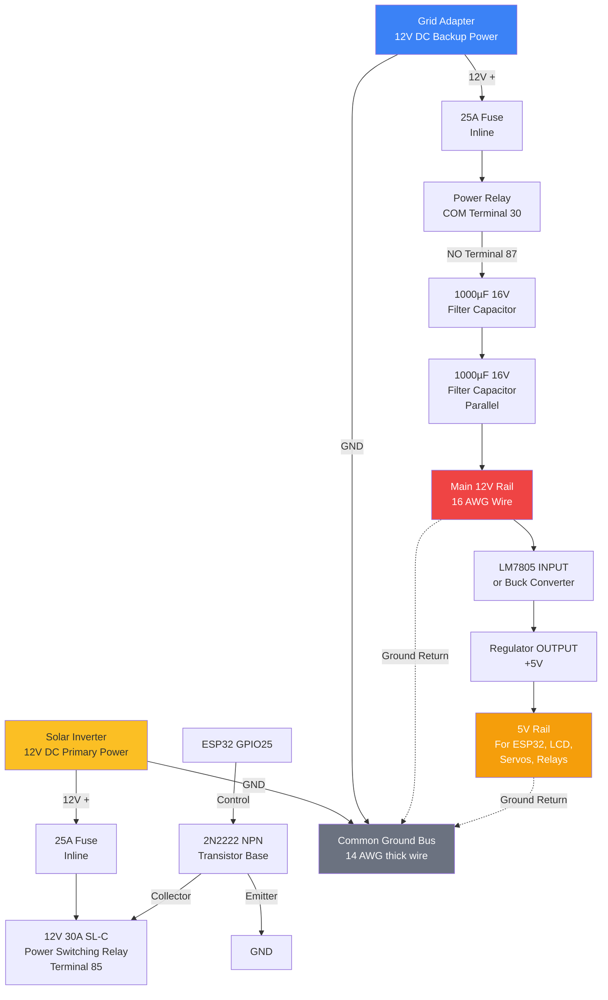
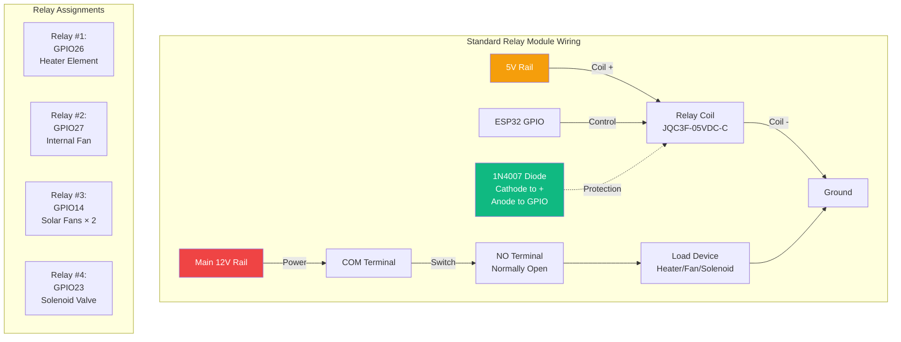
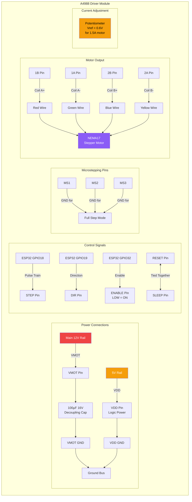
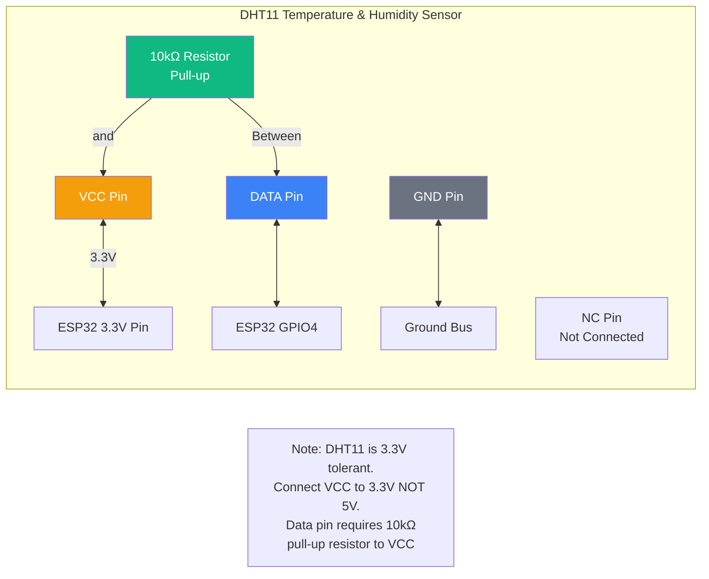
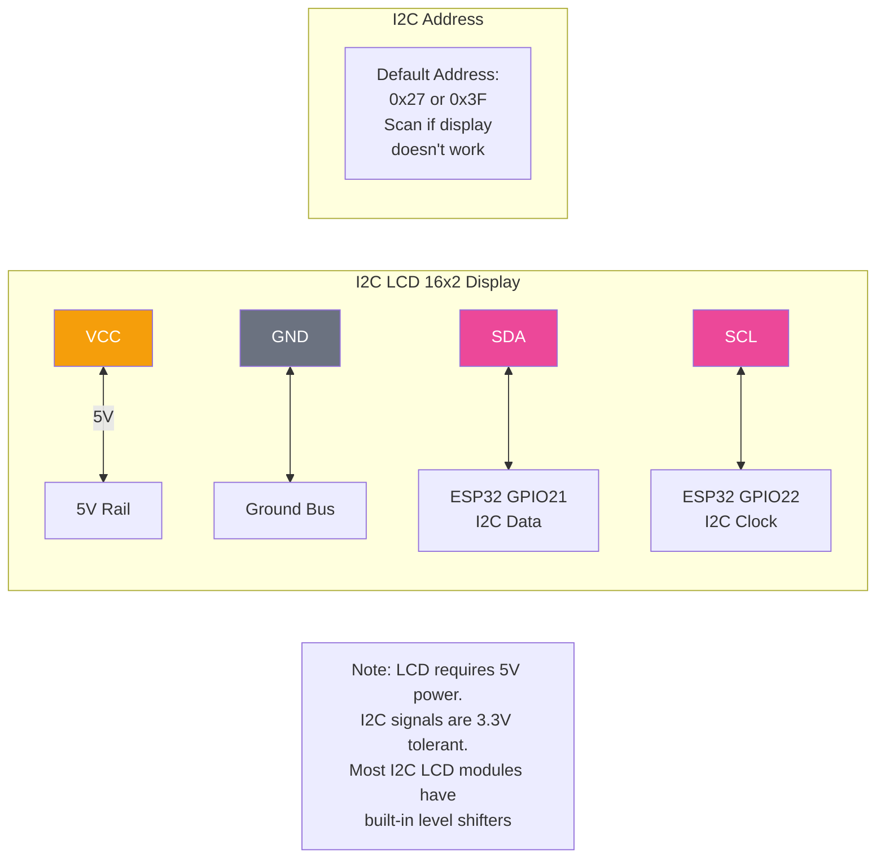
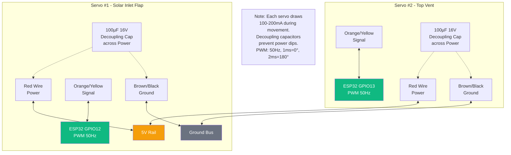
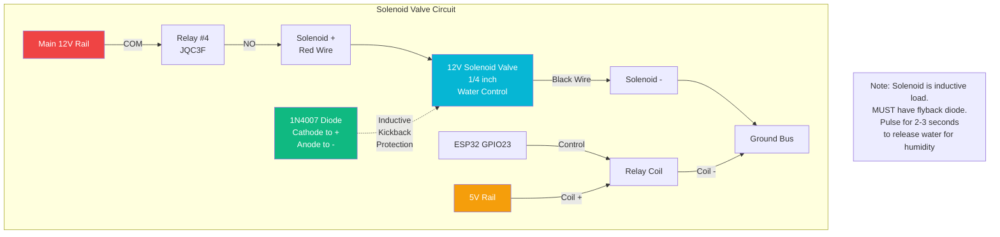
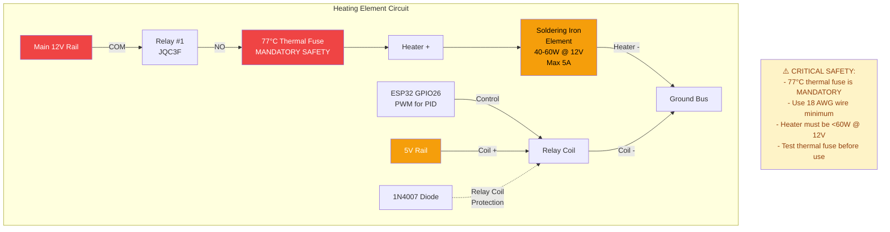

# Wiring Diagram - Mermaid.js Format

This document contains detailed wiring diagrams in Mermaid.js format for the ESP32 Solar Egg Incubator system.

## Complete System Wiring Diagram

```mermaid
graph TB
    subgraph "Power Distribution"
        SolarInv[Solar Inverter<br/>12V DC]
        GridAdapt[Grid Adapter<br/>12V DC]
        Fuse1[25A Fuse]
        Fuse2[25A Fuse]
        PowerSwitch[12V 30A SL-C<br/>Power Relay]
        Cap1[1000µF<br/>Capacitor]
        Cap2[1000µF<br/>Capacitor]
        MainRail[Main 12V Rail]
        Regulator[LM7805 or<br/>Buck Converter<br/>12V→5V]
        Rail5V[5V Rail]
        GndBus[Common Ground Bus<br/>14 AWG]

        SolarInv -->|+12V| Fuse1
        GridAdapt -->|+12V| Fuse2
        Fuse1 --> PowerSwitch
        Fuse2 --> PowerSwitch
        PowerSwitch --> Cap1
        Cap1 --> Cap2
        Cap2 --> MainRail
        MainRail --> Regulator
        Regulator --> Rail5V
        SolarInv -->|GND| GndBus
        GridAdapt -->|GND| GndBus
    end

    subgraph "ESP32 Microcontroller"
        ESP32[ESP32 DevKit]
        Rail5V -->|5V| ESP32
        GndBus -->|GND| ESP32

        GPIO4[GPIO4<br/>DHT11 Data]
        GPIO12[GPIO12<br/>Servo1 PWM]
        GPIO13[GPIO13<br/>Servo2 PWM]
        GPIO14[GPIO14<br/>Solar Fans Relay]
        GPIO18[GPIO18<br/>Stepper STEP]
        GPIO19[GPIO19<br/>Stepper DIR]
        GPIO21[GPIO21<br/>I2C SDA]
        GPIO22[GPIO22<br/>I2C SCL]
        GPIO23[GPIO23<br/>Solenoid Relay]
        GPIO26[GPIO26<br/>Heater Relay]
        GPIO27[GPIO27<br/>Int Fan Relay]
        GPIO32[GPIO32<br/>Stepper ENABLE]

        ESP32 --- GPIO4
        ESP32 --- GPIO12
        ESP32 --- GPIO13
        ESP32 --- GPIO14
        ESP32 --- GPIO18
        ESP32 --- GPIO19
        ESP32 --- GPIO21
        ESP32 --- GPIO22
        ESP32 --- GPIO23
        ESP32 --- GPIO26
        ESP32 --- GPIO27
        ESP32 --- GPIO32
    end

    subgraph "Sensors"
        DHT11[DHT11<br/>Temp/Humidity]
        PullUp[10kΩ<br/>Pull-up]
        LCD[I2C LCD 16x2<br/>Address: 0x27]

        ESP32 -->|3.3V| DHT11
        GPIO4 --> DHT11
        DHT11 -->|Data| PullUp
        PullUp -->|3.3V| ESP32
        DHT11 -->|GND| GndBus

        Rail5V -->|5V| LCD
        GPIO21 -->|SDA| LCD
        GPIO22 -->|SCL| LCD
        LCD -->|GND| GndBus
    end

    subgraph "Relay Module #1 - Heater"
        Relay1[JQC3F Relay<br/>5V Coil]
        Diode1[1N4007<br/>Flyback Diode]
        HeaterElem[Soldering Iron<br/>40-60W @ 12V]
        ThermalFuse[77°C<br/>Thermal Fuse]

        Rail5V -->|Coil +| Relay1
        GPIO26 -->|Coil -| Relay1
        Diode1 -.->|Protection| Relay1
        MainRail -->|COM| Relay1
        Relay1 -->|NO| ThermalFuse
        ThermalFuse --> HeaterElem
        HeaterElem -->|GND| GndBus
    end

    subgraph "Relay Module #2 - Internal Fan"
        Relay2[JQC3F Relay<br/>5V Coil]
        Diode2[1N4007<br/>Flyback Diode]
        IntFan[12V DC Fan<br/>60mm 0.2A]

        Rail5V -->|Coil +| Relay2
        GPIO27 -->|Coil -| Relay2
        Diode2 -.->|Protection| Relay2
        MainRail -->|COM| Relay2
        Relay2 -->|NO| IntFan
        IntFan -->|GND| GndBus
    end

    subgraph "Relay Module #3 - Solar Fans"
        Relay3[JQC3F Relay<br/>5V Coil]
        Diode3[1N4007<br/>Flyback Diode]
        SolarFan1[12V DC Fan<br/>60mm 0.2A]
        SolarFan2[12V DC Fan<br/>60mm 0.2A]
        Junction[Junction<br/>Parallel]

        Rail5V -->|Coil +| Relay3
        GPIO14 -->|Coil -| Relay3
        Diode3 -.->|Protection| Relay3
        MainRail -->|COM| Relay3
        Relay3 -->|NO| Junction
        Junction --> SolarFan1
        Junction --> SolarFan2
        SolarFan1 -->|GND| GndBus
        SolarFan2 -->|GND| GndBus
    end

    subgraph "Relay Module #4 - Solenoid"
        Relay4[JQC3F Relay<br/>5V Coil]
        Diode4[1N4007<br/>Flyback Diode]
        Solenoid[12V Solenoid<br/>Valve 1/4"]
        Diode5[1N4007<br/>Solenoid Diode]

        Rail5V -->|Coil +| Relay4
        GPIO23 -->|Coil -| Relay4
        Diode4 -.->|Protection| Relay4
        MainRail -->|COM| Relay4
        Relay4 -->|NO| Solenoid
        Diode5 -.->|Protection| Solenoid
        Solenoid -->|GND| GndBus
    end

    subgraph "Servo Motors"
        Servo1[SG90<br/>Solar Inlet Flap]
        Servo2[SG90<br/>Top Vent]
        ServoCap1[100µF<br/>Decoupling]
        ServoCap2[100µF<br/>Decoupling]

        Rail5V -->|Power| ServoCap1
        ServoCap1 --> Servo1
        GPIO12 -->|Signal| Servo1
        Servo1 -->|GND| GndBus

        Rail5V -->|Power| ServoCap2
        ServoCap2 --> Servo2
        GPIO13 -->|Signal| Servo2
        Servo2 -->|GND| GndBus
    end

    subgraph "Stepper Motor System"
        A4988[A4988<br/>Driver Module]
        DriverCap[100µF<br/>Decoupling]
        NEMA17[NEMA17<br/>Stepper Motor<br/>1.8°/step]

        MainRail -->|VMOT| DriverCap
        DriverCap --> A4988
        Rail5V -->|VDD| A4988
        GPIO18 -->|STEP| A4988
        GPIO19 -->|DIR| A4988
        GPIO32 -->|ENABLE| A4988
        A4988 -->|1B Coil A+| NEMA17
        A4988 -->|1A Coil A-| NEMA17
        A4988 -->|2B Coil B+| NEMA17
        A4988 -->|2A Coil B-| NEMA17
        A4988 -->|GND| GndBus
    end

    style ESP32 fill:#3b82f6,color:#fff
    style MainRail fill:#ef4444,color:#fff
    style Rail5V fill:#f59e0b,color:#fff
    style GndBus fill:#6b7280,color:#fff
```

## ESP32 GPIO Pinout Diagram

```mermaid
graph LR
    subgraph "ESP32 DevKit Pinout"
        subgraph "Left Side"
            EN[EN]
            VP[VP GPIO36]
            VN[VN GPIO39]
            G34[GPIO34]
            G35[GPIO35]
            G32[GPIO32 - STEPPER ENABLE]
            G33[GPIO33]
            G25[GPIO25]
            G26[GPIO26 - HEATER RELAY]
            G27[GPIO27 - INT FAN RELAY]
            G14[GPIO14 - SOLAR FANS]
            G12[GPIO12 - SERVO 1]
            G13[GPIO13 - SERVO 2]
            GND1[GND]
            VIN[VIN]
        end

        subgraph "Right Side"
            G23[GPIO23 - SOLENOID]
            G22[GPIO22 - I2C SCL]
            TX[TX GPIO1]
            RX[RX GPIO3]
            G21[GPIO21 - I2C SDA]
            G19[GPIO19 - STEPPER DIR]
            G18[GPIO18 - STEPPER STEP]
            G5[GPIO5]
            G17[GPIO17]
            G16[GPIO16]
            G4[GPIO4 - DHT11]
            G0[GPIO0]
            G2[GPIO2]
            G15[GPIO15]
            GND2[GND]
            V3[3.3V]
        end
    end

    G32 -.-> StepperEnable[To A4988 ENABLE]
    G26 -.-> HeaterRelay[To Relay #1 Coil]
    G27 -.-> FanRelay[To Relay #2 Coil]
    G14 -.-> SolarRelay[To Relay #3 Coil]
    G12 -.-> Servo1Sig[To Servo 1 Signal]
    G13 -.-> Servo2Sig[To Servo 2 Signal]
    G23 -.-> SolenoidRelay[To Relay #4 Coil]
    G22 -.-> LCDSCL[To LCD SCL]
    G21 -.-> LCDSDA[To LCD SDA]
    G19 -.-> StepperDIR[To A4988 DIR]
    G18 -.-> StepperSTEP[To A4988 STEP]
    G4 -.-> DHT11Data[To DHT11 Data Pin]

    style G32 fill:#8b5cf6,color:#fff
    style G26 fill:#ef4444,color:#fff
    style G27 fill:#3b82f6,color:#fff
    style G14 fill:#f59e0b,color:#fff
    style G12 fill:#10b981,color:#fff
    style G13 fill:#10b981,color:#fff
    style G23 fill:#06b6d4,color:#fff
    style G22 fill:#ec4899,color:#fff
    style G21 fill:#ec4899,color:#fff
    style G19 fill:#8b5cf6,color:#fff
    style G18 fill:#8b5cf6,color:#fff
    style G4 fill:#f59e0b,color:#fff
```



## Power Distribution Network



## Relay Module Wiring Pattern (All 4 Relays)



## A4988 Stepper Driver Wiring



## DHT11 Sensor Wiring



## I2C LCD 16x2 Wiring



## Servo Motor Wiring (SG90)



## Solenoid Valve Wiring with Protection



## Heater Circuit with Safety



---

## Wire Gauge Reference

| Circuit | Wire Gauge | Color Coding | Max Current |
|---------|----------|--------------|-------------|
| Main 12V Rails | 16 AWG | Red (+) / Black (-) | 10A |
| Heater Circuit | 18 AWG | Red (+) / Black (-) | 5A |
| Fan Circuits | 20-22 AWG | Red (+) / Black (-) | 0.5A |
| GPIO Signals | 22-24 AWG | Various | 40mA |
| Ground Bus | 14 AWG | Black or bare copper | 15A+ |
| I2C Signals | 24-26 AWG | Color coded | 1mA |

---

## Assembly Checklist

- [ ] Install both 25A fuses FIRST before any connections
- [ ] Set up common ground bus with 14 AWG wire
- [ ] Wire 5V regulator with input/output filter capacitors
- [ ] Connect ESP32 to 5V and verify power LED
- [ ] Install all 6 flyback diodes (4 relays + solenoid + heater relay)
- [ ] Wire DHT11 with 10kΩ pull-up resistor
- [ ] Connect I2C LCD (verify address with I2C scanner)
- [ ] Wire all 4 relay modules with proper protection
- [ ] Connect servos with decoupling capacitors
- [ ] Wire A4988 driver with 100µF capacitor
- [ ] Connect NEMA17 with correct coil pairs
- [ ] Install 77°C thermal fuse on heater circuit
- [ ] Test each subsystem before final assembly
- [ ] Verify all polarities with multimeter
- [ ] Cable management: separate high-current from signals

---

**⚠️ Safety Warning**: Always disconnect ALL power sources before working on the circuit. Double-check all connections before applying power. Test with loads disconnected first.
